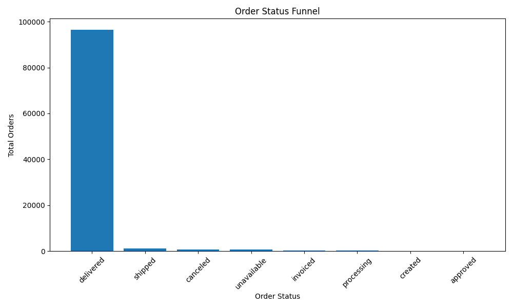
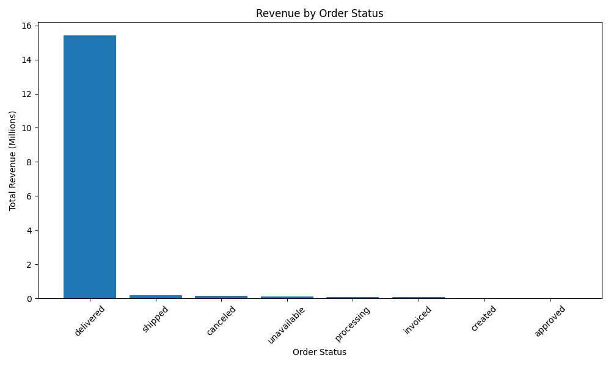
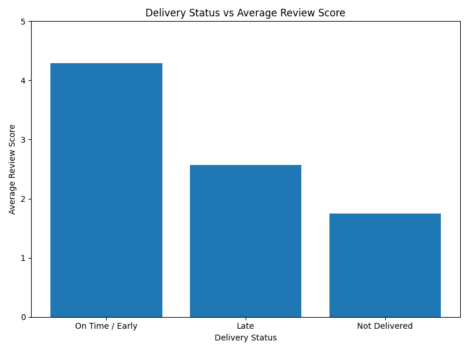

# Olist E-commerce Conversion Analysis

## Project Objective

This project analyses the Olist Brazilian E-commerce dataset to understand order lifecycle performance, revenue impact, delivery efficiency, and customer satisfaction.

The main goal is to identify where orders are successfully completed, where drop-offs happen, and how these issues may affect business performance.

## Tools Used

* SQL
* DuckDB
* Python
* Pandas
* NumPy
* Power BI

## Dataset

Dataset used: Olist Brazilian E-commerce Dataset from Kaggle.

The original CSV files are not uploaded to this repository because of file size. The dataset can be downloaded separately from Kaggle.

Main files used:

* olist_orders_dataset.csv
* olist_order_payments_dataset.csv
* olist_customers_dataset.csv
* olist_order_items_dataset.csv
* olist_products_dataset.csv
* olist_order_reviews_dataset.csv

## Business Questions

1. What percentage of orders are successfully delivered?
2. Which order stages create the biggest drop-off?
3. How much revenue is linked to each order status?
4. Does delivery delay affect customer review score?
5. Which product categories generate the most revenue?
6. Which customer or product segments show the strongest performance?

## Current Analysis

The first analysis focuses on the order lifecycle funnel using the `order_status` column.

### Order Status Funnel Result

| Order Status | Total Orders | Percentage |
| ------------ | -----------: | ---------: |
| delivered    |       96,478 |     97.02% |
| shipped      |        1,107 |      1.11% |
| canceled     |          625 |      0.63% |
| unavailable  |          609 |      0.61% |
| invoiced     |          314 |      0.32% |
| processing   |          301 |      0.30% |
| created      |            5 |      0.01% |
| approved     |            2 |      0.00% |

## Key Insight

Around 97.02% of orders were successfully delivered, while around 2.98% were cancelled, unavailable, or stuck in earlier stages. These incomplete orders may represent potential revenue loss and customer dissatisfaction.

## Project Structure

```text
olist-ecommerce-conversion-analysis/
│
├── sql/
│   └── order_status_funnel.sql
│
├── python/
│   └── run_first_query.py
│
├── visuals/
│
├── powerbi/
│
├── README.md
└── requirements.txt
```

## Skills Demonstrated

* SQL aggregation
* Funnel analysis
* Data cleaning preparation
* Python-based analysis workflow
* Business insight generation
* E-commerce performance analysis
* Dashboard planning

## Next Steps

* Analyse revenue by order status
* Analyse delivery delays
* Connect delivery performance with review scores
* Build Power BI dashboard
* Add dashboard screenshots and final business recommendations

## Delivery Performance Insight

Around 89.15% of orders were delivered on time or earlier than the estimated delivery date. However, 7.87% of orders were delivered late and 2.98% were not delivered. This shows that although most deliveries were successful, late and undelivered orders may negatively affect customer satisfaction and future purchase behaviour.

## Delivery Delay vs Review Score Insight

Delivery performance has a strong relationship with customer satisfaction. Orders delivered on time or early had an average review score of 4.29, while late deliveries had a much lower average score of 2.57. Orders that were not delivered had the lowest average score of 1.75. This suggests that improving delivery reliability can directly improve customer experience and review scores.


## Product Category Revenue Insight

The highest revenue category was health and beauty, generating around 1.23 million from delivered orders. Watches and gifts followed closely with around 1.17 million, while bed, table and bath generated around 1.02 million. These categories are key revenue drivers and should be prioritised for inventory planning, promotions, and seller performance monitoring.


## Customer State Revenue Insight

São Paulo (SP) is the strongest customer market, generating around 5.77 million in revenue from delivered orders. Rio de Janeiro (RJ) and Minas Gerais (MG) are the next strongest regions, generating around 2.06 million and 1.82 million respectively. This shows that revenue is highly concentrated in a few key states, especially São Paulo, which should be prioritised for marketing, logistics, and customer retention strategies.


## Visualizations

### Order Status Funnel


### Revenue by Order Status



## Project Summary

This project is an end-to-end e-commerce analytics case study using the Olist Brazilian E-commerce dataset. The analysis focuses on order lifecycle performance, revenue impact, delivery reliability, customer satisfaction, product category performance, and customer location trends.

The analysis found that 97.02% of orders were successfully delivered, but late and undelivered orders had much lower review scores. Revenue was also concentrated in a few product categories and customer states, showing opportunities to improve logistics, marketing focus, and customer experience.

### Delivery Status vs Average Review Score

